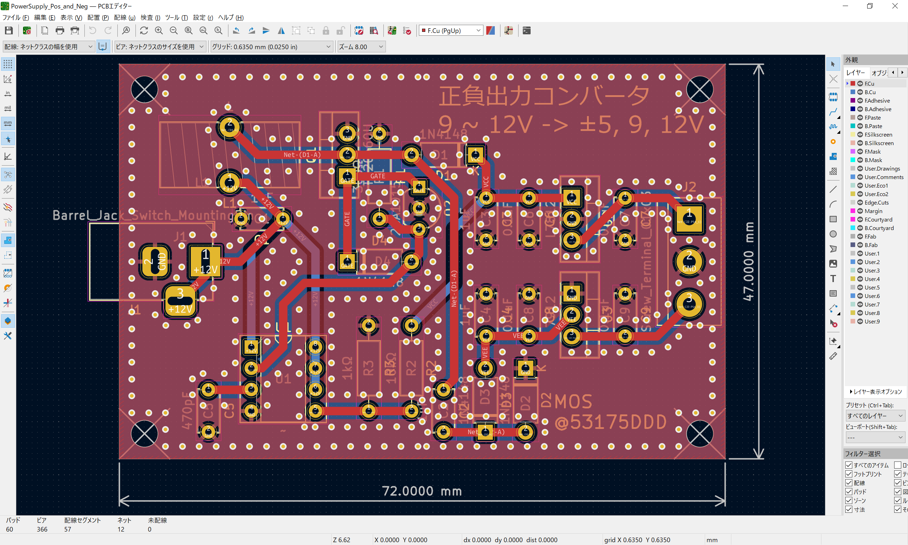

# 正負出力電源装置

## 概要

DC 9 ~ 12V を入力すると，正負出力に変換する電源回路です  
実装する定電圧レギュレータにより出力電圧が異なります

| 正側レギュレータ（U2）の種類 | 出力電圧 | 負側レギュレータ（U3）の種類 | 出力電圧 |
|:----:|----:|:----:|----:|
| NJM7812 | 12V | NJM7912 | -12V |
| NJM7809 | 9V | NJM7909 | -9V |
| NJM7805 | 5V | NJM7905 | -5V |

## 部品表

| アノテーション | 部品定数等 | リンク |
|:----|:----|:----|
| C1 - C4 | 1uF | <https://akizukidenshi.com/catalog/g/gP-08150/> |
| C5 | 470pF | <https://akizukidenshi.com/catalog/g/gP-08130/> |
| C6 - C9 | 0.1uF | <https://akizukidenshi.com/catalog/g/gP-10147/> |
| D1 - D4 | 1N4148 | <https://akizukidenshi.com/catalog/g/gI-00941/> |
| J1 | 2.1mm DC ジャック | <https://akizukidenshi.com/catalog/g/gC-06568/> |
| J2 | 3P ターミナルブロック | <https://akizukidenshi.com/catalog/g/gP-01307/> |
| L1 | 220uH | <https://akizukidenshi.com/catalog/g/gP-13381/> |
| Q1 | TK20A60U | <https://akizukidenshi.com/catalog/g/gI-08419/> |
| Q2 | 2SA1015 | <https://akizukidenshi.com/catalog/g/gI-02612/> |
| R1 | 330Ω | <https://akizukidenshi.com/catalog/g/gR-25331/> |
| R2 | 12kΩ | <https://akizukidenshi.com/catalog/g/gR-25123/> |
| R3 | 1kΩ | <https://akizukidenshi.com/catalog/g/gR-16102/> |
| U1 | NJM2374 | <https://akizukidenshi.com/catalog/g/gI-12901/> |
| U2 | NJM7812 等 | <https://akizukidenshi.com/catalog/g/gI-00163/> |
| U3 | NJM7912 等 | <https://akizukidenshi.com/catalog/g/gI-17482/> |

## 回路図

## 設計イメージ図

## 3D イメージ図

# LICENSE

[CC BY-NC-SA 4.0](https://creativecommons.org/licenses/by-nc-sa/4.0/deed.ja) で公開します．ただし，営利目的で利用したい場合はその旨を `tatarariku(at)gmail.com` にてご相談ください
